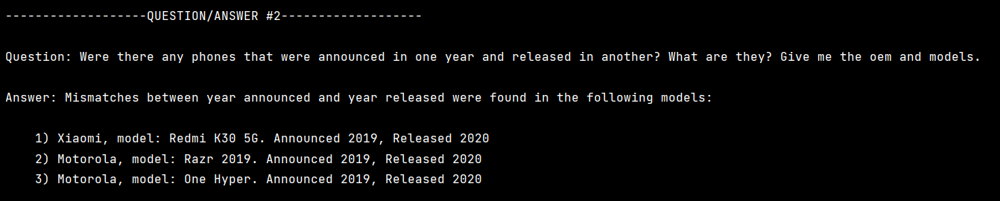
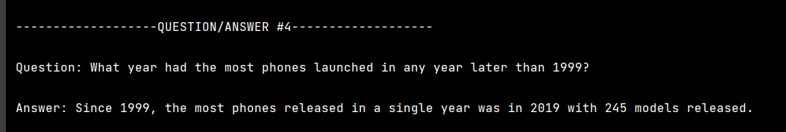

# Alternative Language Project

### Author: Cheryl Moser

---

### Table of Contents

* [Language](#chosen-language-and-version-kotlin-v190)
* [Features](#some-language-features)
* [Libraries](#libraries-used-up-to-3-if-any)
* [Answers](#answer-the-following-questions)
  * [Company with highest average weight](#what-company-oem-has-the-highest-average-weight-of-the-phone-body)
  * [Phones announced one year, released another](#was-there-any-phones-that-were-announced-in-one-year-and-released-in-another-what-are-they-give-me-the-oem-and-models)
  * [Phones with only one feature sensor](#how-many-phones-have-only-one-feature-sensor)
  * [Most phones launched (year) after 1999](#what-year-had-the-most-phones-launched-in-any-year-later-than-1999-)

## Chosen language and version: Kotlin v1.9.0

I chose this programming language because I am a fan of Android. I was going to
do C++, but it's so prevalent that I figured I will be learning that on my own time
soon no matter what.

## Some Language features

* *object-oriented programming*
  <br>Kotlin uses classes, which can be instantiated as objects. Classes may have
  class functions. Kotlin supports subclasses and superclasses.<br><br>

* *file ingestion*
  <br>Kotlin is derived from Java, and as such, there exists the ability to import
  java packages. For this project, I imported java.io.File and used its readLines()
  function. For example:

```
import java.io.File

fun main() {
    val fileName = <filename here>
    File(fileName).readLines()
    ...content here...
}
```

* *conditional statements*
  <br>Kotlin uses if, if-else, the 'is' operator, and 'when' expressions for
  conditional statements. For example:

```dtd
//if and if-else #1
if (x > 5){
    <do something> //could stop here or continue with else
} else {
    <do something else>
}

//if-else #2
val result = if (x > 5) <do something> else <do something else>

//when
val x = 5
when (x){
    5 -> "yay x is 5!"
    6 -> "hey, x is not 5!"
    else -> "what is x, anyway?"
    
//is
val obj: Any = "I'm an object"
when(obj){
    is String -> "I'm a String object"
    is Int -> "I'm an Int object"
    else -> "I don't know what type of object I am"
```

* *assignment statements*
  <br>Kotlin supports the '=' assignment operator, as well as combination operators.
  These assignments include addition (+=), subtraction (-=), multiplication (*=),
  division (/=), and modulus (%=).<br><br>

* *Loops*
  <br>Kotlin supports for-loops, while-loops, and do-while-loops.<br><br>

* *subprograms (functions/methods)*
  <br>Subprograms are signalled by the 'fun' keyword. Subprograms can exist as part
  of a class, or they can exist in their own separate file, as long as they exist
  within the same package.<br><br>

* *Unit testing and exception handling*
  <br>Typically, JUnit is imported to perform unit testing. Kotlin is interoperable
  with Java, which makes this convenient.
  <br>Kotlin uses try-catch blocks, and try-catch-finally blocks for exception handling,
  as well as the keyword 'throw'.

## Libraries used (up to 3, if any)

* JUnit for unit testing
* OpenJDK: corretto-17 for runtime environment
* KotlinJavaRuntime: runtime and Java interoperability component

## Answer the following questions

#### What company (oem) has the highest average weight of the phone body?


#### Was there any phones that were announced in one year and released in another? What are they? Give me the oem and models.


#### How many phones have only one feature sensor?


#### What year had the most phones launched in any year later than 1999? 

